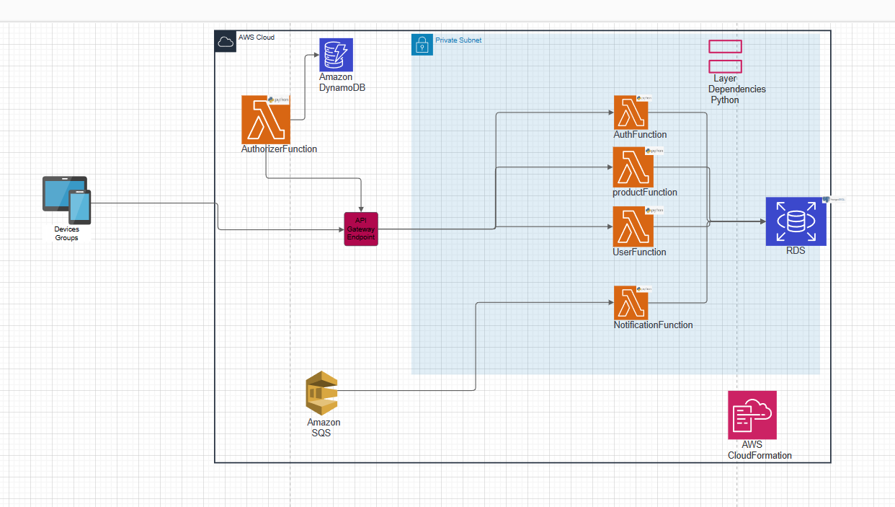
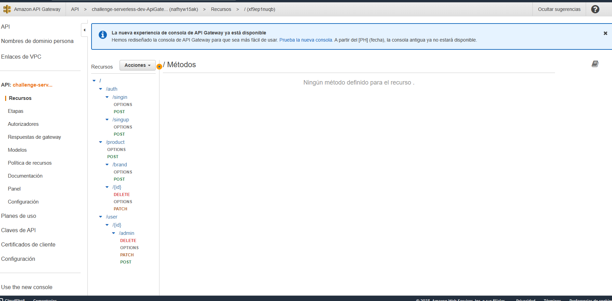
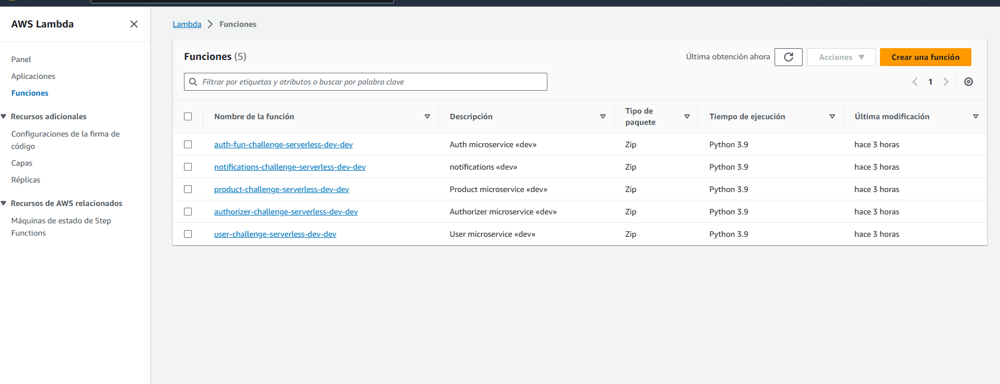
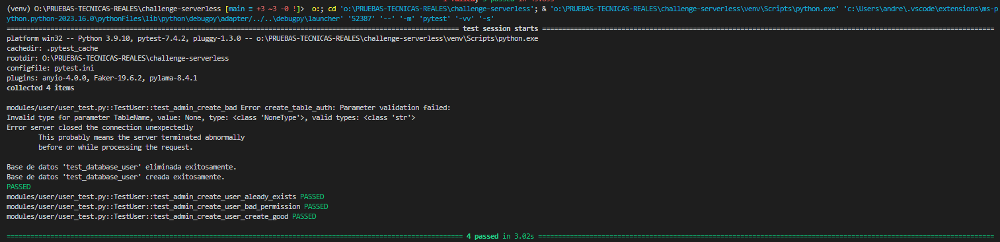
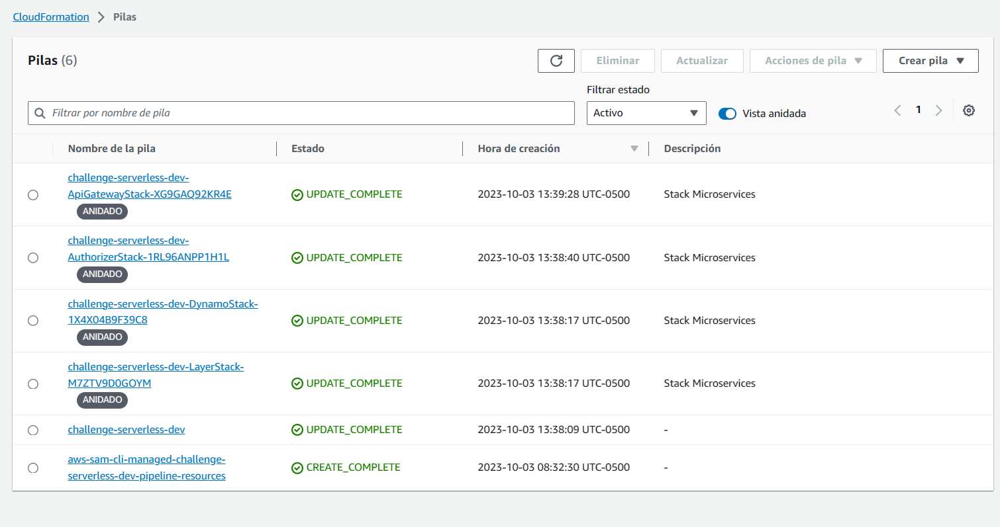
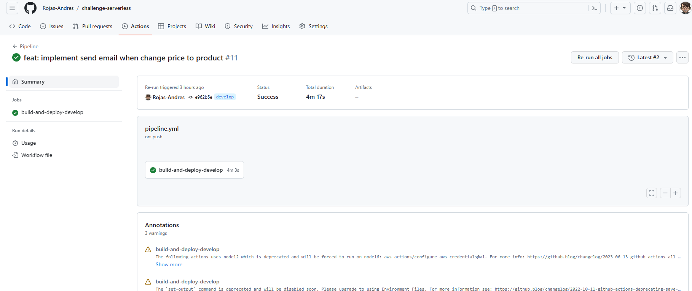
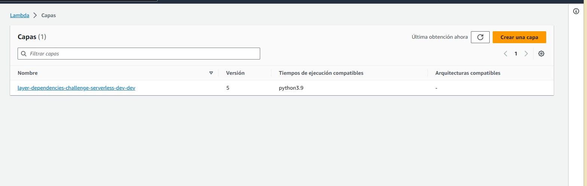

## Anotaciones
1. Roles
    - Super admin (encargado de crear, eliminar , actualizar usuarios admin)
        - Lo pense principalmente para que los administradores no se puedan eliminar entre si y que solo lo haga un super admin.
    - Admin (encargado de crear o actualizar productos)
        - El admin solo puede eliminar o actualizar productos, no va a tener permisos ni de editarse a si mismo , ni de eliminarse y mucho menos de eliminar otros usuarios
    - Usuario (Usuario de la plataforma)
        - El usuario por ahora solo podra ver los productos
    - Usuario anonimo ( usuario que no esta registrado en la plataforma)
2. Se agregan dos columnas a la tabla de productos , la cual es create_by y update_by que hace referencia a cual fue el usuario que creo el producto y el update_by hace referencia al usuario que actualizo el producto
3. Por defecto no se eliminara el producto porque si un producto es eliminado tambien se elimina el historial de las visitas de los usuarios anonimos y por lo tanto no se tendria una verdadera traza. Lo que hice fue añadir una columna llamada delete_at y actualizar el sku a sku_delete_hora.
4. El sku es unico para cada producto.
5. Cuando se actualiza un precio al producto, se obtienen los usuarios admin de la aplicacion y se llama al sqs que se encargara de enviar la notificacion de que el producto fue editado.
6. La carpeta shared_package se encuentran todos los archivos que se podrian reutilizar en las otras funciones lambda.
7. En la carpeta layer_dependencies_basic se encuentra las librerias que normalmente uso en las funciones lambda y aca es donde mediante el job de github creo el layer para usar en las respectivas funciones.
8. Las migraciones a la base de datos la estoy usando mediante alembic.
9. En la carpeta collections_postman se encuentran todas las collecioens de postman que tengo hasta el momento.
10. En la carpeta .github/workflows esta el archivo que uso para automatizar el despliegue
11. El docker-compose lo iba a usar para generar las migraciones localmente y configurar un cicd para validar el coverage con github actions

# Cosas por implementar
1. Implementacion de un proxy de lectura y escritura de la base de datos
2. Implementacion de la tabla product_view_user
3. Implementacion pre-commit y linters
4. Implementacion de coverge.
5. Validaciones de TTL para los tokens generados en dynamo
6. Terminacion de test para todas las apis.

URL: Api gateway https://nafhyw15ak.execute-api.us-west-2.amazonaws.com/dev

# Diagrama Infra

# Api gateway deploy

# Lambdas deploy

# Test

# Cloudformation deploy success

# CICD deploy success

# Capa Lambda deploy success

## Run project local without Docker
virtualenv venv
pip install -r local.txt
python main.py
** Solo levantar la base de datos del docker-compose y apagar el servicio de fastapi
.env

DB_USER=postgres
DB_PASSWORD=postgres
DB_HOST_WRITER=localhost
DB_HOST_READ=localhost
DB_PORT=5433
DB_NAME=postgres
ENVIRONMENT=local
TOKEN_EXPIRATION=3600
SECRET_KEY=secret_key

# RUN migrations alembic

alembic revision --autogenerate -m "generate new models"
alembic upgrade heads

# RUN Docker-compose local

docker-compose -f docker-compose.testing.yml build
docker-compose -f docker-compose.testing.yml up --force-recreate --build

## preconfigure.Dockerfile

- Este dockerfile se creo con el fin de que quede preconfigurado todas las librerias y todo lo necesario para el proyecto , por otra parte si se desea actualizar alguna libreria o crear añadir una nueva en su defecto , tocaria actualizar el ECR y ya.

Para ello se debe de configurar el profile de symptomps
aws ecr-public get-login-password --region us-east-1 --profile wts | docker login --username AWS --password-stdin public.ecr.aws

`docker build -t nombre_imagen .`
`docker build -t fastapi_image -f preconfigure.Dockerfile .`
`docker tag fastapi_image:latest public.ecr.aws/m7j0n8s6/testing`
`docker push public.ecr.aws/m7j0n8s6/testing`

## Documentacion para generar los roles y credenciales para configurar el cicd
https://aws.amazon.com/es/blogs/compute/introducing-aws-sam-pipelines-automatically-generate-deployment-pipelines-for-serverless-applications/